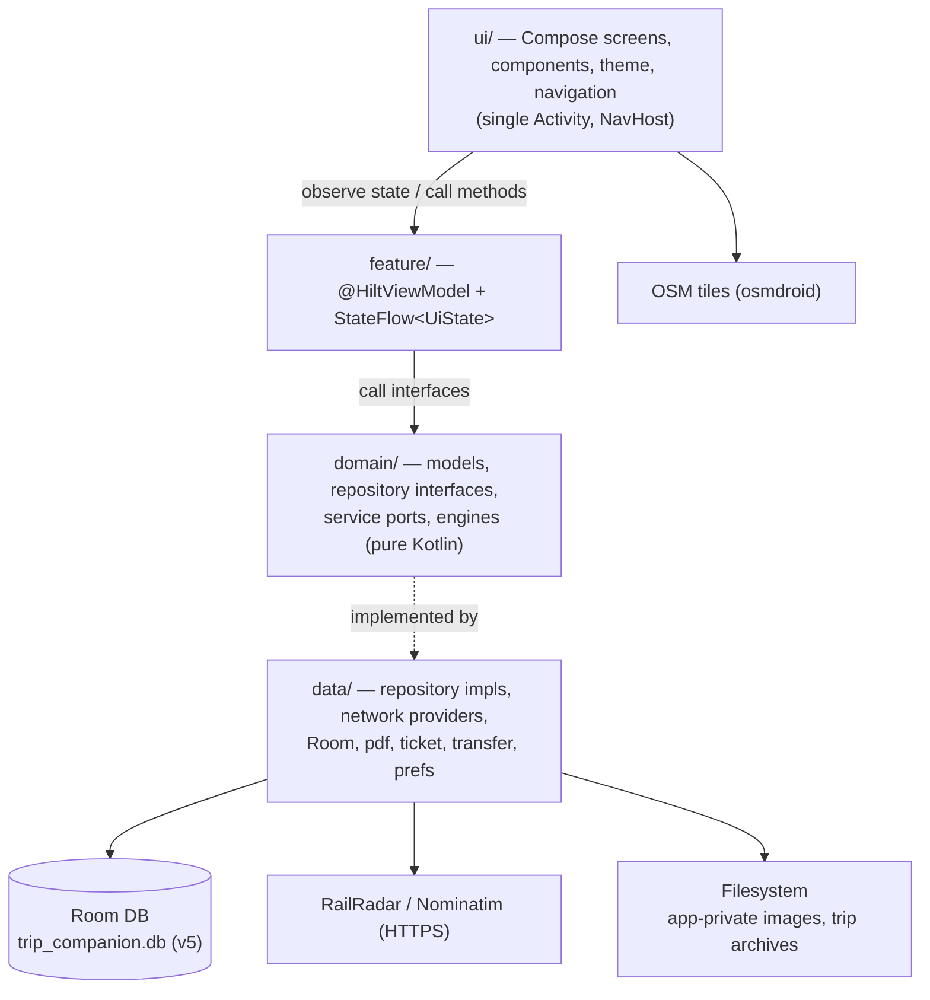

# ARCHITECTURE.md

Actual architecture as discovered in the repository (2026-08-24). Where something is inferred rather
than confirmed by reading the file, it is marked `UNVERIFIED`. The product spec's *conceptual* model
is in [Udaipur_Trip_Companion_Product_Spec_v2.md](Udaipur_Trip_Companion_Product_Spec_v2.md); this
file documents what is *implemented*.

## System overview

Single-module (`:app`), single-Activity native Android app. Clean layered architecture with
one-way dependencies: **UI → Feature (ViewModels) → Domain → Data**. No backend of our own; the only
network egress is RailRadar (trains), Nominatim (geocoding), and OSM tiles. Everything a trip needs
is stored locally (Room + app-private files), so the app is fully usable offline.



The **§11 boundary**: HTTP/JSON/vendor/API-key details never appear above `data/`. Domain exposes
**ports** (interfaces) and value/enum results; `data/` holds the concrete providers and the Hilt
module chooses which one is bound.

## Directory / module responsibilities

Package root: `com.tripcompanion.app`.

| Package | Responsibility |
|---|---|
| `MainActivity`, `TripCompanionApp` | Single Activity host; `@HiltAndroidApp` application. |
| `core/time` | `TimeProvider` — the clock, injected so "now" is testable. |
| `core/util` | `DateTimeUtils`, `GeoUtils` — pure helpers (formatting, distance). |
| `domain/model` | Plain Kotlin data classes + enums: `Trip`, `Event`, `EventType`, `EventStatus`, `Location`, `Activity`, `PlannedPhoto`, `Train`, `TrainStop`, `TrainRunStatus`, `TrainPassenger`, `TrainFare`, `TrainAllotment`, `StayDetails`, `ParsedTicket`, `SearchResultLocation`, `TripStatus`, `ActivityStatus`. |
| `domain/repository` | Repository **interfaces** (one per aggregate): `Trip/Event/Location/Activity/PlannedPhoto/Train/StayDetails`. |
| `domain/service` | Ports + result types: `TrainStatusProvider`, `TrainStatusService`, `PnrLookupService`, `LocationSearchService`, `TicketImportService`, `TripTransferService`, `JourneyEventLinker`. |
| `domain/engine` | Deterministic computation: `TripStateEngine` (current state), `TrainProgress` (position/ETA from status), `TripStats`. |
| `data/local` | Room: `TripDatabase`, `dao/*`, `entity/*`, `converter/Converters`, `EntityMappers` (entity⇄domain), `Migrations`, `ImageStorageHelper`. |
| `data/repository` | `*RepositoryImpl` — implement domain repositories over DAOs + mappers. |
| `data/network` | `NominatimLocationSearchProvider`, `ScheduleProjectionTrainStatusProvider`, and `railradar/` (client, parser, error, live provider, PNR service, key qualifier). |
| `data/train` | `DefaultTrainStatusService` — the policy layer (cache TTL, force refresh, outcome mapping) over a `TrainStatusProvider`. |
| `data/ticket`, `data/pdf` | IRCTC e-ticket import: `TicketFileReader`, `PdfTextExtractor`/`PdfText`, `IrctcTicketParser`, `IrctcTicketImportService`. |
| `data/transfer` | Trip export/import: `TripArchive`, `TripArchiveFiles`, `TripManifest`, `TripImagesDir`, `TripTransferServiceImpl`. |
| `data/search` | `DefaultLocationSearchService` (policy over the search provider). |
| `data/prefs` | `UserPreferencesStore` (DataStore — theme). |
| `data/SampleTripSeeder` | The **only** place trip-specific ("Udaipur"/"Agra") *data* lives. |
| `di` | Hilt modules: `DatabaseModule`, `RepositoryModule`, `TrainModule`, `SearchModule`, `TicketModule`, `TransferModule`, `TimeModule`. |
| `feature/*` | ViewModels grouped by feature: `trip` (Home, Timeline, TripList, TripEditor), `event`, `train`, `stay`, `place`, `location`, `map`, `photo`, `settings`, `more`. |
| `ui/screens` | One Composable screen per destination (~20 screens). |
| `ui/components` | Reusable Compose: `AppPrimitives` (`AppCard`, `AppMediaCard`, buttons…), `Cards`, `Media` (`AppImage`, `PhotoBackdrop`, `HeroImage`…), `Timeline`, `OsmMap`, `EventTypeVisuals`, `TrainVisuals`, `SettingsRow`. |
| `ui/theme` | `AppTheme`, `AppMetrics`, `Color`, `ExtendedColors`, `Shape`, `Type`, `ThemeManager`. |
| `ui/navigation` | `Routes` (every route + `createRoute` + arg-key constants), `AppNavHost` (the `NavHost`). |

## UI architecture

- **Jetpack Compose + Material 3**, single Activity, `NavHost` with routes defined in
  [Routes.kt](../app/src/main/java/com/tripcompanion/app/ui/navigation/Routes.kt). Each `Routes`
  object owns its pattern and `createRoute(...)`; **argument names are load-bearing** — they are
  read back by name from a `SavedStateHandle` in the matching ViewModel, and all args are passed as
  strings parsed with `toLongOrNull` (a bad deep link lands on an empty state, not a crash).
- Screens are stateless-ish: they `collectAsStateWithLifecycle()` a ViewModel `StateFlow` and call
  VM methods. Theme tokens come from `AppThemeExtended` (colors/metrics/text) layered over M3.
- Cross-screen results (e.g. the location picker's chosen place) return via the **calling entry's**
  `SavedStateHandle`, not a route arg, so a half-filled form isn't recreated
  (see `Routes.LocationPicker.RESULT_LOCATION_ID`).

## State management

MVVM. `@HiltViewModel` ViewModels expose a single immutable `data class *State` via
`StateFlow`, updated with `_state.update { it.copy(...) }`. Repositories return `Flow`s (from Room);
ViewModels `combine`/`map`/derive into UI state. Coroutines via `viewModelScope`. No global event bus.

## Data flow (example: Home next-up card)

```mermaid
sequenceDiagram
    participant Room
    participant Repo as Repositories (Event/Location/Train/Stay/Photo)
    participant VM as HomeViewModel
    participant UI as HomeScreen
    Room-->>Repo: Flow<entities>
    Repo-->>VM: Flow<domain models> (mapped)
    VM->>VM: TripStateEngine computes "next up"; nextUpImageUri() resolves photo
    VM-->>UI: StateFlow<HomeUiState>
    UI->>UI: render NextUpSection (PhotoBackdrop for activity / solid for train)
    UI->>VM: onSkip / onComplete / onOpen
    VM->>Repo: mutate → Room → Flow re-emits → UI updates
```

## Persistence layer (Room)

- DB `trip_companion.db`, `@Database(version = 5, exportSchema = true)` in
  [TripDatabase.kt](../app/src/main/java/com/tripcompanion/app/data/local/TripDatabase.kt).
- **Entities (11):** `TripEntity`, `EventEntity`, `LocationEntity`, `ActivityEntity`,
  `PlannedPhotoEntity`, `TrainEntity`, `TrainStopEntity`, `TrainRunStatusEntity`, `TrainRunStopEntity`,
  `TrainPassengerEntity`, `StayDetailsEntity` (11 `@Entity` classes in 10 files —
  `TrainRunStopEntity` shares a file). The 10 DAOs in `data/local/dao/*` return `Flow`s.
- **Entity ⇄ domain mapping** is centralized in
  [EntityMappers.kt](../app/src/main/java/com/tripcompanion/app/data/local/EntityMappers.kt).
- **Type converters** in `converter/Converters.kt` (e.g. `LocalDateTime` ⇄ stored form). `UNVERIFIED`:
  exact stored representation.
- **Migrations** in [Migrations.kt](../app/src/main/java/com/tripcompanion/app/data/local/Migrations.kt):
  `MIGRATION_1_2`, `_2_3`, `_3_4`, `_4_5`, exposed as `Migrations.ALL`. Schemas exported to
  `app/schemas/…TripDatabase/` (`1,3,4,5.json`). **No destructive fallback** (see
  [DECISIONS.md](DECISIONS.md)). Instrumented `MigrationTest` validates each step.
- **Implemented schema is a pragmatic subset/adaptation of the spec's §18 conceptual model.**
  Notably: no separate `Traveler`/`Task` tables; a *Journey* is realized as a `Train` booking plus a
  `JOURNEY`-type `Event`, linked by `JourneyEventLinker`; type-detail is split into `StayDetails`
  (stay), `Train`/`TrainStop` (journey), `Activity` (visit), `PlannedPhoto` (photo inspiration/media).

## Networking / external services (behind ports)

- **Train status** — port `TrainStatusProvider`; two impls:
  - `railradar/RailRadarTrainStatusProvider` (`isLive = true`) — real API, via `RailRadarClient`
    (HTTPS, `X-API-Key`) + `RailRadarParser` (unwraps `{success,data,meta}`).
  - `ScheduleProjectionTrainStatusProvider` (`isLive = false`) — offline; projects a position from
    the stored timetable + clock.
  - Selected in [TrainModule.kt](../app/src/main/java/com/tripcompanion/app/di/TrainModule.kt) by
    whether `BuildConfig.RAILRADAR_API_KEY` is non-blank. `DefaultTrainStatusService` adds caching
    (Room snapshot, 2-min TTL, 12 s timeout) and maps to `TrainStatusOutcome` (`Updated`/`Cached`/`Failed`).
- **PNR lookup** — port `PnrLookupService`; impl `railradar/RailRadarPnrLookupService` (always bound;
  reports `isAvailable = false` when the key is blank so the UI hides the affordance). Maps
  `GET /v1/pnr/{pnr}` → `ParsedTicket` (fills coach/berth/status; names blank — IR PNR omits them).
- **Location search / geocoding** — port `LocationSearchService`/provider; impl
  `NominatimLocationSearchProvider` (OpenStreetMap Nominatim).
- **Maps** — osmdroid tiles rendered by `ui/components/OsmMap`; no API key, tiles cached by osmdroid.
- **Ticket import** — `TicketImportService`/`IrctcTicketImportService`: read PDF text
  (`PdfTextExtractor`) → parse (`IrctcTicketParser`) → `ParsedTicket` → editor fills the form.
- **Trip transfer** — `TripTransferService`/impl: export/import a trip (+ images) as an archive.

## Background processing

`UNVERIFIED` — no WorkManager dependency is present; refresh appears to be foreground/on-demand
(pull-to-refresh, screen open). The spec mentions notifications/WorkManager as future work; not yet
wired. Confirm before assuming any background scheduling exists.

## Authentication

None — the app has no user accounts or login. The only credential is the RailRadar API key
(`local.properties` → `BuildConfig.RAILRADAR_API_KEY`, header auth). **Device location/GPS is not
wired**: `AndroidManifest.xml` declares only `INTERNET` + `ACCESS_NETWORK_STATE` (no
`ACCESS_FINE/COARSE_LOCATION`). The spec's location features are therefore spec-only today; the
2026-08-24 Map epic (see [TODO.md](TODO.md)) is where GPS would be added.

## Important design patterns

- **Ports & adapters** for every external capability (the §11 boundary).
- **MVVM + unidirectional state** (`StateFlow<State>`, `copy`-based updates).
- **Repository pattern** with interface/impl split across `domain`/`data` and centralized mapping.
- **Provider-selection via Hilt** `@Provides` returning an interface, choosing impl at runtime
  (`javax.inject.Provider` defers construction of the unused branch).
- **Result-as-value** for expected failures (sealed `*Outcome`, classified `*Error` enums).
- **Designed empty/placeholder states** (e.g. `AppImage` renders a category-tinted gradient instead
  of a broken-image box).
- **Deterministic engines** isolated in `domain/engine` for unit-testing without Android.

## Key dependencies (see `gradle/libs.versions.toml`)

Compose BOM `2025.06.01`, Material3, Hilt `2.56.2`, Room `2.7.1`, Navigation-Compose `2.9.0`,
DataStore `1.1.1`, Coil `2.7.0`, osmdroid `6.1.20`, Coroutines `1.10.2`. Test: JUnit4, Turbine,
`kotlinx-coroutines-test`, `org.json` (real, for parser tests), Room testing, Hilt testing.
