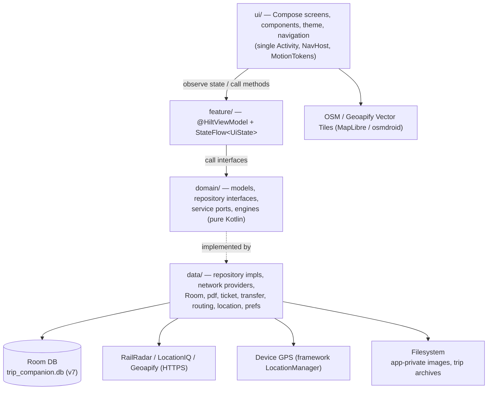

# ARCHITECTURE.md

Actual architecture as discovered in the repository (updated 2026-08-30). Where something is inferred rather
than confirmed by reading the file, it is marked `UNVERIFIED`. The product spec's *conceptual* model
is in [Udaipur_Trip_Companion_Product_Spec_v2.md](Udaipur_Trip_Companion_Product_Spec_v2.md); this
file documents what is *implemented*.

## System overview

Single-module (`:app`), single-Activity native Android app. Clean layered architecture with
one-way dependencies: **UI → Feature (ViewModels) → Domain → Data**. No backend of our own; network
egress is strictly scoped to RailRadar (train running status), LocationIQ (geocoding & place search),
Geoapify / OpenRouteService (trip road routing), and OSM / Geoapify vector basemap tiles. Everything a trip needs is stored locally (Room + app-private files),
so the app is fully usable offline.

The **§11 boundary**: HTTP/JSON/vendor/API-key details never appear above `data/`. Domain exposes
**ports** (interfaces) and value/enum results; `data/` holds the concrete providers and the Hilt
module chooses which one is bound.

## Directory / module responsibilities

Package root: `com.tripcompanion.app`.

| Package | Responsibility |
|---|---|
| `MainActivity`, `TripCompanionApp` | Single Activity host; `@HiltAndroidApp` application; motion environment provider. |
| `core/time` | `TimeProvider` — the clock, injected so "now" is testable. |
| `core/util` | `DateTimeUtils`, `GeoUtils`, `TimeDeviationUtils` — pure helpers (formatting, distance, time diffs); `ExternalNavigator` — hands off to the device maps app via `Intent` (ADR-018). |
| `domain/model` | Plain Kotlin data classes + enums: `Trip`, `Event`, `EventType`, `EventStatus`, `Location`, `Activity`, `PlannedPhoto`, `Train`, `TrainStop`, `TrainRunStatus`, `TrainPassenger`, `TrainFare`, `TrainAllotment`, `StayDetails`, `ParsedTicket`, `SearchResultLocation`, `TripStatus`, `ActivityStatus`, `DayRouteModels`. |
| `domain/repository` | Repository **interfaces** (one per aggregate): `Trip/Event/Location/Activity/PlannedPhoto/Train/StayDetails`. |
| `domain/service` | Ports + result types: `TrainStatusProvider`, `TrainStatusService`, `PnrLookupService`, `LocationSearchService`, `TicketImportService`, `TripTransferService`, `JourneyEventLinker`, `RoutePlanService`/`RoutePlanProvider` (trip road route + per-leg travel), `DeviceLocationProvider` (device GPS). |
| `domain/engine` | Deterministic computation: `TripStateEngine` (current state & stay lifecycle), `TrainProgress` (position/ETA from status), `TrainArrivalAutomator`, `TripStats`. |
| `data/local` | Room: `TripDatabase`, `dao/*`, `entity/*`, `converter/Converters`, `EntityMappers` (entity⇄domain), `Migrations`, `ImageStorageHelper`. |
| `data/repository` | `*RepositoryImpl` — implement domain repositories over DAOs + mappers with entity deduplication. |
| `data/network` | `locationiq/` (client, provider, key qualifier), `geoapify/` (client, route provider, key qualifier), `railradar/` (client, parser, error, live provider, PNR service, key qualifier), `openrouteservice/` (route provider + key qualifier), `NominatimLocationSearchProvider`, `ScheduleProjectionTrainStatusProvider`. |
| `data/routing` | `DefaultRoutePlanService` — the routing policy layer (waypoint bounds, 12 s timeout, outcome mapping) over a `RoutePlanProvider`. |
| `data/location` | `AndroidDeviceLocationProvider` — framework `LocationManager` (GPS+NETWORK, no Play Services) behind `DeviceLocationProvider`. |
| `data/train` | `DefaultTrainStatusService` — the policy layer (cache TTL, force refresh, outcome mapping) over a `TrainStatusProvider`. |
| `data/ticket`, `data/pdf` | IRCTC e-ticket import: `TicketFileReader`, `PdfTextExtractor`/`PdfText`, `IrctcTicketParser`, `IrctcTicketImportService`. |
| `data/transfer` | Trip export/import: `TripArchive`, `TripArchiveFiles`, `TripManifest`, `TripImagesDir`, `TripTransferServiceImpl`. |
| `data/search` | `DefaultLocationSearchService` (policy over the search provider). |
| `data/prefs` | `UserPreferencesStore` (DataStore — theme). |
| `data/SampleTripSeeder` | The **only** place trip-specific ("Udaipur"/"Agra") *data* lives; idempotent seeding. |
| `di` | Hilt modules: `DatabaseModule`, `RepositoryModule`, `TrainModule`, `SearchModule`, `LocationIqModule`, `GeoapifyModule`, `TicketModule`, `TransferModule`, `TimeModule`, `RoutingModule`, `LocationModule`. |
| `feature/*` | ViewModels grouped by feature: `trip` (Home, Timeline, TripList, TripEditor), `event`, `train`, `stay`, `place`, `location`, `map`, `photo`, `settings`, `more`. |
| `ui/screens` | One Composable screen per destination (~20 screens), including `TimelineScreen` with horizontal date paging and `TripMapScreen`. |
| `ui/components` | Reusable Compose: `AppPrimitives` (tactile buttons, cards, calm `EmptyState`…), `TeardropPinMarker` (frosted callout badges & category pins), `Timeline`, `OsmMap`, `TripVectorMap`, `SettingsRow`. |
| `ui/theme` | `AppTheme`, `AppMetrics`, `Color`, `ExtendedColors`, `MotionTokens`, `Shape`, `Type`, `ThemeManager`. |
| `ui/navigation` | `Routes`, `AppNavHost` (fixed bottom navigation with sliding pill, directional tab transitions, vertical stack pushes). |

## UI architecture & Motion System

- **Jetpack Compose + Material 3**, single Activity, `NavHost` with routes defined in `Routes.kt`.
- **Cohesive Motion System (ADR-021):**
  - Standardized durations (220–280ms) and `FastOutSlowInEasing` defined in `MotionTokens.kt`.
  - Stationary bottom navigation bar with a single sliding blue indicator pill (`AppBottomNavigation`).
  - Directional horizontal slide + fade (16dp, 240ms) when navigating between bottom tabs.
  - Smooth vertical slide + fade (24dp, 240ms) for detail and editor pushes.
  - Tactile press feedback modifiers (`Modifier.pressFeedback`, `Modifier.fabPressFeedback`).
  - Staggered entrance animations (`Modifier.staggeredEntrance`).
  - Respects system reduced-motion preferences (`LocalReducedMotion`).
  - Map screen route intentionally preserved without custom transitions for peak canvas performance.
- **Itinerary Date Paging (ADR-022):**
  - `TimelineScreen` embeds a `HorizontalPager` bounded to `state.days`.
  - Bidirectional synchronization with `DaySelector` tab strip (including auto-scroll).
  - Isolated `LazyColumn`s per day maintain independent vertical scroll states.
  - Multi-day cached state in `TimelineViewModel` (`allDayEvents`, `allPlaces`, etc.).
- **Editorial Map HUD & Pin Badges (ADR-025):**
  - Three-pill top floating header with Back, flex `DayTripPill`, and spinning Refresh action.
  - Dedicated right-side Recenter FAB positioned ergonomically for one-handed thumb interaction.
  - High-contrast frosted callout badges for map markers with subtle drop shadows and dark/light mode legibility.

## State management

MVVM. `@HiltViewModel` ViewModels expose a single immutable `data class *State` via
`StateFlow`, updated with `_state.update { it.copy(...) }`. Repositories return `Flow`s (from Room);
ViewModels `combine`/`map`/derive into UI state. Coroutines via `viewModelScope`. No global event bus.

## Persistence layer (Room)

- DB `trip_companion.db`, `@Database(version = 7, exportSchema = true)` in
  [TripDatabase.kt](../app/src/main/java/com/tripcompanion/app/data/local/TripDatabase.kt).
- **Entities (11):** `TripEntity`, `EventEntity`, `LocationEntity`, `ActivityEntity`,
  `PlannedPhotoEntity`, `TrainEntity`, `TrainStopEntity`, `TrainRunStatusEntity`, `TrainRunStopEntity`,
  `TrainPassengerEntity`, `StayDetailsEntity`.
- **Entity ⇄ domain mapping** centralized in `EntityMappers.kt`.
- **Migrations** in `Migrations.kt` (`MIGRATION_1_2..6_7`). **No destructive fallback** (ADR-006).
- **Deduplication:** Lookup queries on DAOs prevent duplicate entities on import or repeated seeding.

## Key dependencies (see `gradle/libs.versions.toml`)

Compose BOM `2025.06.01`, Material3, Hilt `2.56.2`, Room `2.7.1`, Navigation-Compose `2.9.0`,
DataStore `1.1.1`, Coil `2.7.0`, osmdroid `6.1.20`, MapLibre `11.7.0`, Coroutines `1.10.2`.
Test: JUnit4, Turbine, `kotlinx-coroutines-test`, `org.json`, Room testing, Hilt testing.
